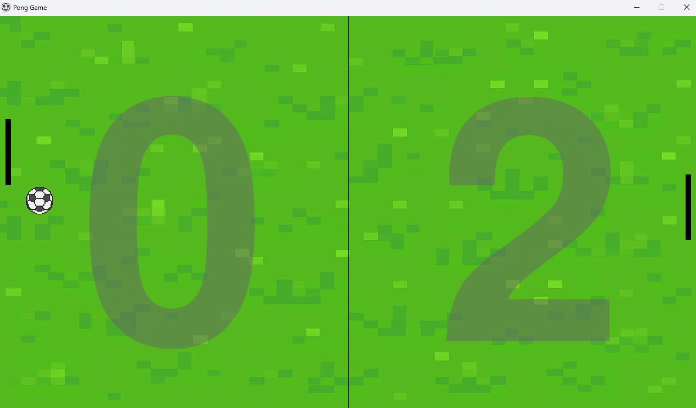

# Pong Game 🏓


Um remake simples do clássico jogo **Pong** feito em Python com Pygame.  
Desafie-se sozinho ou contra um amigo e tente marcar 3 pontos primeiro!

## Como Jogar

- **Jogador 1 (esquerda)**
  - Mover para cima: `W`
  - Mover para baixo: `S`

- **Jogador 2 (direita)**
  - Mover para cima: `Seta para cima`
  - Mover para baixo: `Seta para baixo`

- Reiniciar partida: `R`
- Sair do jogo: `Z`

## Preview


## Instalação

1. Clone este repositório:  
   ```bash
   git clone https://github.com/seu-usuario/pong-game.git
